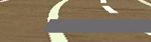
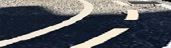
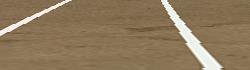
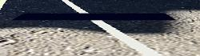
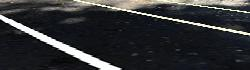
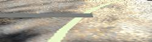

# Road Simulator

The road_simulator is part of the 'ironcar' project.
To see what the ironcar project is, go to the [ironcar repository](https://github.com/vinzeebreak/ironcar).  
If you want to get the full tutorial for the entire project (ironcar hardware, software, simulator and model generation, you can also go [there](https://docs.google.com/document/d/1jyRhlbmthMA_DuuulYnzUT38okIF_KFZH0a4hh8NCg8/edit?usp=sharing).

This simulator generates 'fake' pictures of a road as seen by a 1/10th car with a wide angle camera and creates a deep-learning model based on these images. We used it to get (250 * 70) RGB dimensional track pictures. It is quite fast (we can generate 100,000 images in 15 minutes which is faster than driving the car ourselves and capturing the images), and far more accurate in the learning process (less approximations of curves etc).

These are examples of what can be (very easily) generated:


  |  |  |    
:-------------------------:|:-------------------------:|:-------------------------:|:-------------------------:
  |  |  |  
  |   |   |  


With the model created in `example/model_cnn.py` and a dataset of 100,000 images created via simulator, we achieved a 94% accuracy and managed to get our car to successfully finish a lap on 2 different circuits it had never seen before !

## Getting started

The following code is meant to be in the road_simulator directory. Please adapt `./src/` and `./ground_pics`to fit your current layout.
```python
import sys
sys.path.insert(0, './src/')
```

Each simulator is composed of layers to make it easy to adapt to your particular situation/track. The simpliest type of generator is the default `Simulator` object:
```python
from simulator import Simulator

simulator = Simulator()
```

Then, we add layers to our generator:

```python
from colors import White
from layers.layers import Background, DrawLines, Perspective, Crop

white = White()

simulator.add(Background(n_backgrounds=3, path='./ground_pics', input_size=(250, 200)))
simulator.add(DrawLines(input_size=(250, 200), color_range=white))
simulator.add(Perspective())
simulator.add(Crop())
```

White object gives a range of white-ish colors to draw the lines. They may not appear exactly white on the images.
There exists three colors for now (Yellow, White and DarkShadow) and a generic Color class. You can add more colors by replicating the yellow example.

Now, let's generate the images. We just need to write:

```python
simulator.generate(n_examples=100, path='my_dataset')
```
where you need to set the number of images to be generated `n_examples` and the path you want them to be generated in `path`.


## Creating a model

You can simply create a keras model.

First, let's load the images and their labels, split in a training and validation sets:
```python
from models.utils import get_datasets

train_X, train_Y, val_X, val_Y, _, _ = get_datasets('my_dataset', n_images=1000)
```
where `n_images` is the maximum number of images you want to get from the dataset 'my_dataset'.

Now, just create the model you want, using keras:

```python
from keras.layers import Input, Convolution2D, MaxPooling2D, Activation
from keras.layers import Flatten, Dense
from keras.models import Model

img_in = Input(shape=(70, 250, 3), name='img_in')
x = img_in

x = Convolution2D(1, 3, 3, activation='relu', border_mode='same')(x)
x = MaxPooling2D(pool_size=(2, 2), strides=(2,2))(x)

x = Convolution2D(2, 3, 3, activation='relu', border_mode='same')(x)
x = MaxPooling2D(pool_size=(2, 2), strides=(2,2))(x)

x = Convolution2D(2, 3, 3, activation='relu', border_mode='same')(x)
x = MaxPooling2D(pool_size=(2, 2), strides=(2,2))(x)

x = Convolution2D(4, 3, 3, activation='relu', border_mode='same')(x)
x = MaxPooling2D(pool_size=(2, 2), strides=(2,2))(x)

flat = Flatten()(x)

x = Dense(20)(flat)
x = Activation('relu')(x)

x = Dense(5)(x)
angle_out = Activation('softmax')(x)

model = Model(input=[img_in], output=[angle_out])
model.compile(optimizer='adam', loss='categorical_crossentropy', metrics=['accuracy'])

model.fit([train_X], train_Y, batch_size=100, nb_epoch=20, validation_data=([val_X], val_Y))
```

And it's done !
